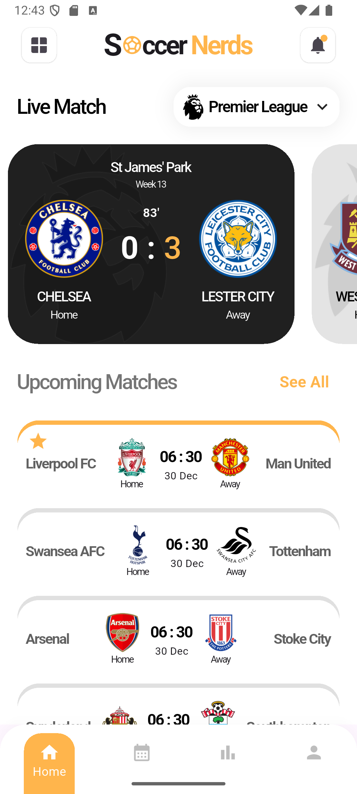
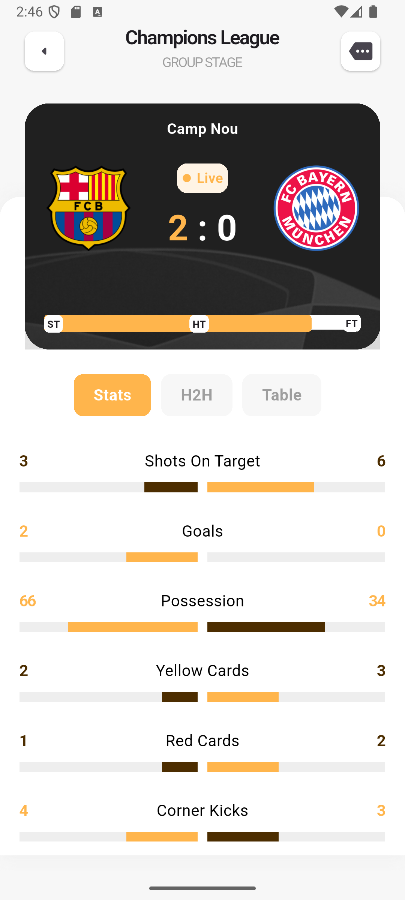

# Football Live Score App (Learning Project)

## Description

This repository contains a Flutter application developed to gain experience in UI design and implementation. The project was created by following a video tutorial that demonstrated app development principles and layout structures using Flutter.

## Screenshots

## Resources
Youtube: [Complete Flutter UI Design Tutorial For Beginners](https://youtu.be/DronqUbOHCo?list=PLcmJOjMPMVkfM29MgeOt9NyjZF1vGeIMH)
